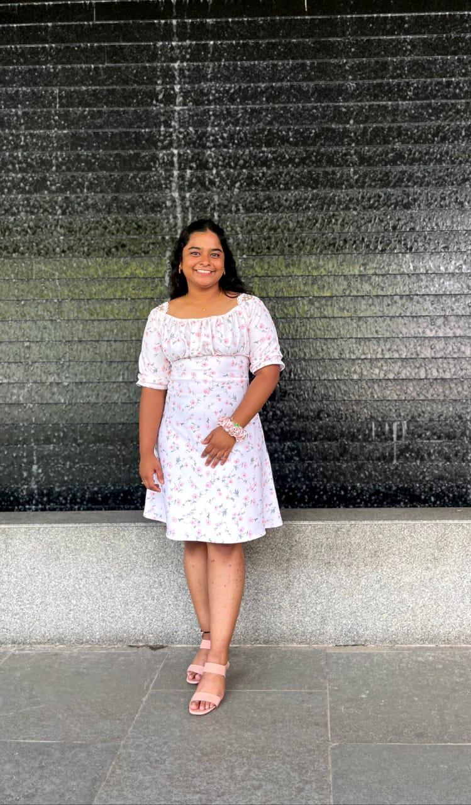

<!DOCTYPE html>
<html lang="en">
<head>
 <meta charset="UTF-8">
 <meta name="viewport" content="width=device-width, initial-scale=1.0">
 <title>Shaakthi's Portfolio</title>
 
</head>
<body>
 <h1>My Biography</h1>
 
 
Hello! My name is Shaakthi. I am doing 3rd year in Int.Mtech in CSE with Data Science in VIT.

 
[Contact: shaakthi.a2022@vitstudent.ac.in - +91 8618068307]

</body>
</html>
